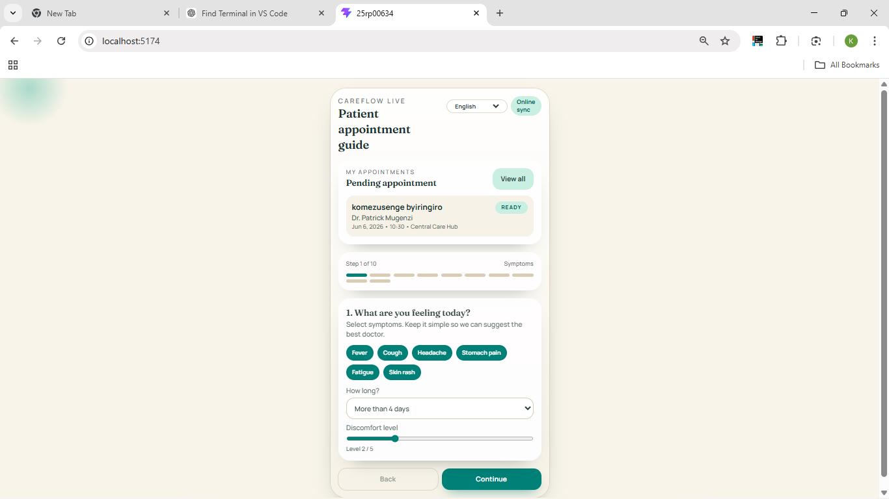
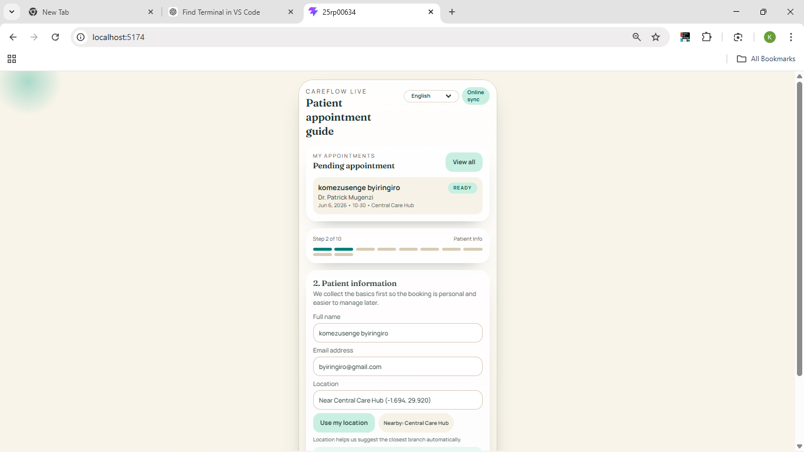
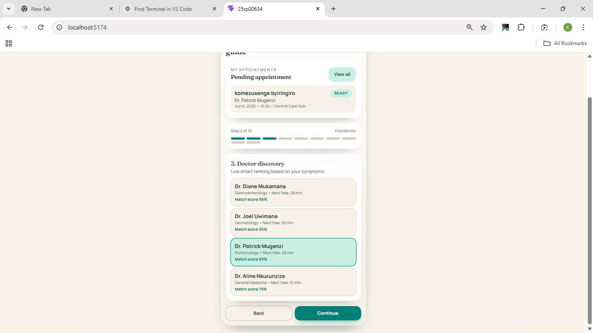
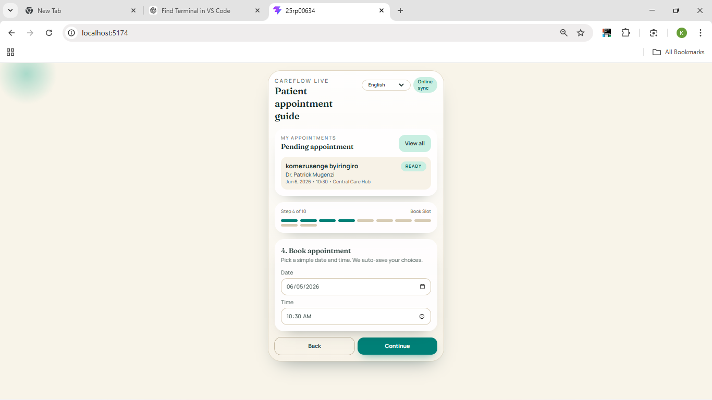
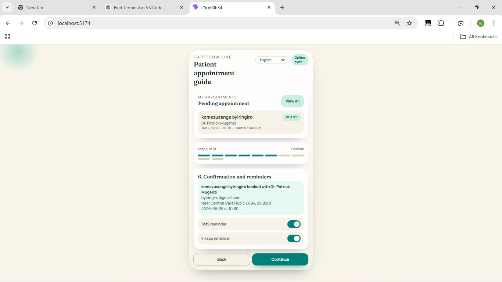
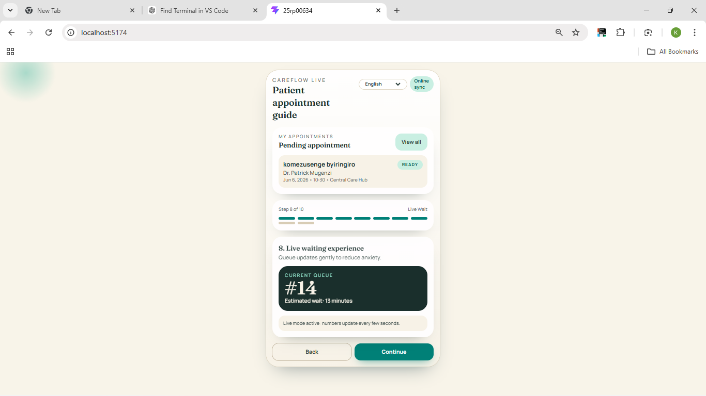
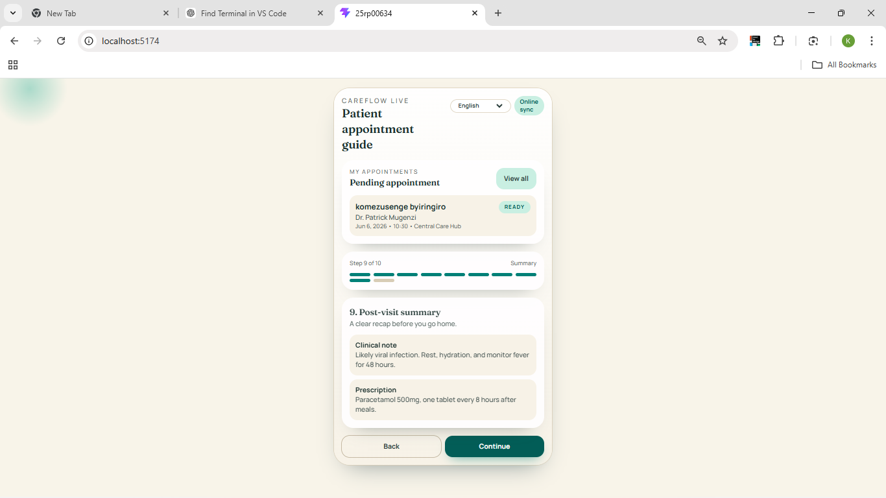
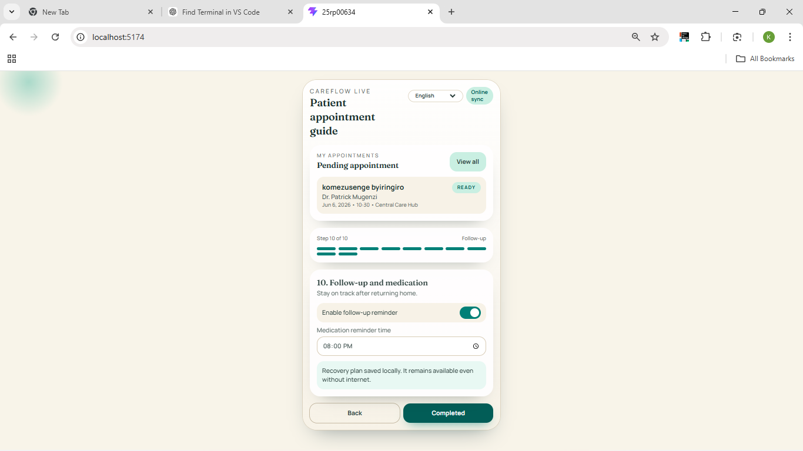
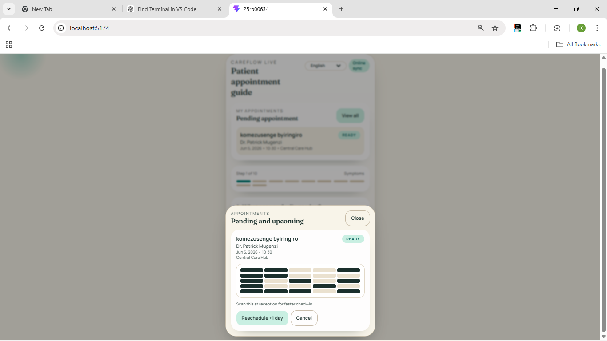

# CareFlow Live - Patient Appointment Experience

Mobile-first healthcare experience designed as a living system, not static screens.

## What Is Implemented

- Guided symptom input with low-cognitive-load controls
- Smart doctor discovery with symptom-based match scoring
- Appointment booking and confirmation with reminder toggles
- Hospital arrival check-in flow
- Live waiting experience with dynamic queue updates
- Post-visit summary and follow-up medication reminder
- Offline-aware behavior and local draft persistence

## Core Constraints Addressed

- Low internet connectivity:
	- Lightweight UI and local-first data flow
	- Offline status indicator and queue fallback messaging
	- State persisted in localStorage (`careflow-draft-v1`)
- First-time smartphone users:
	- One primary action per step
	- Large tap targets, simple labels, short text blocks
- Users in stress/discomfort:
	- Calm mint/sand palette
	- Gentle transitions and clear progress tracking
	- Predictable back/continue navigation

## Required Journey Coverage

1. Symptom input
2. Doctor discovery
3. Appointment booking
4. Confirmation and reminders
5. Hospital arrival/check-in
6. Live waiting experience
7. Post-visit summary
8. Follow-up/medication reminder

## Tech Stack

- React 19
- Vite 8
- Tailwind CSS v4 (`@tailwindcss/vite`)
- Local bundled fonts via `@fontsource` for reliability

## Run Locally

```bash
npm install
npm run dev
```

Production build:

```bash
npm run build
npm run preview
```

## Project Structure

- `src/App.jsx`: full interaction logic, screen flow, reusable component primitives
- `src/index.css`: design tokens, typography, motion, and ambient visual styling
- `vite.config.js`: React + Tailwind plugin configuration
- `FIGMA_SPEC.md`: build-ready Figma structure and prototype instructions

## Notes For Evaluation

- Code structure uses reusable UI primitives (`Button`, `Card`, `Pill`, `Toggle`)
- The prototype-like experience is implemented in code with animated transitions
- Interaction and motion are meaningful (status changes, queue updates, step transitions)
## out put fact(screenshoot)









